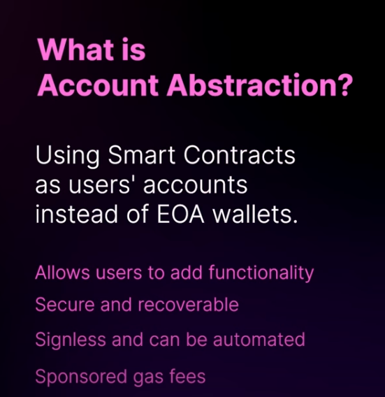

# SmartNFTs - Shop Smart with Smart NFTs with Best UX

Unique Brand Profiles for every user

Gasless Transactions, also known as meta-transactions, are transactions that have the gas fee paid for by a third party instead of the transaction sender.

Typically, this means the Brands cover the gas costs of their users' transactions, providing a more seamless user experience.

This works by having the user sign a message that is then sent to a relayer, which pays the gas fee and forwards the transaction to the blockchain.

